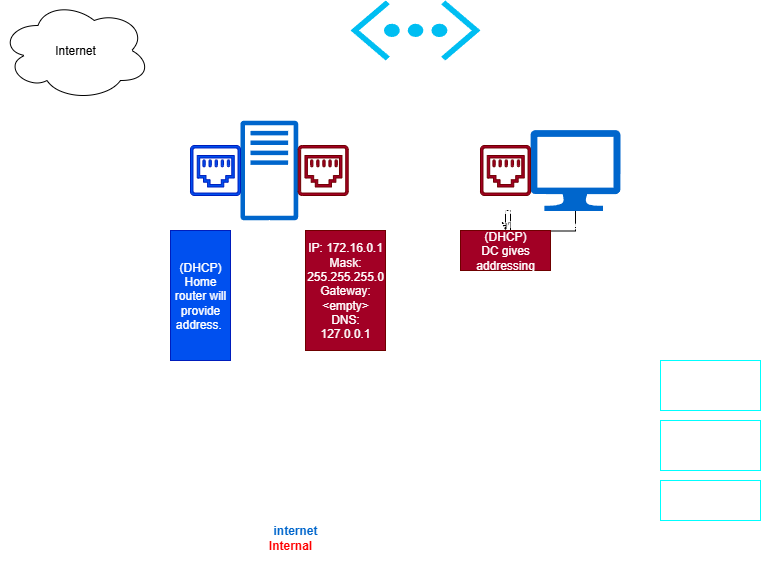

# Network Diagram

The following diagram illustrates the logical layout of my Active Directory home lab environment.  
It was created using **Draw.io** and exported as a `.png` file for inclusion in this repository.

---

## Diagram

---

## Description
- **Domain Controller (Windows Server 2025)**  
  Hosts Active Directory, DNS, and DHCP services. Configured with dual network adapters:
  - NAT for internet connectivity
  - Internal Network for isolated lab communication

- **Windows 10 Client**  
  Joined to the domain via the Internal Network adapter.

- **Networking Setup**  
  Segmentation ensures that internal lab traffic remains isolated from the external internet while still allowing the server to download updates and software.

---

[ Back to Environment Setup](02-environment-setup.md) | [ Next: Active Directory Setup](04-ad-setup.md)
