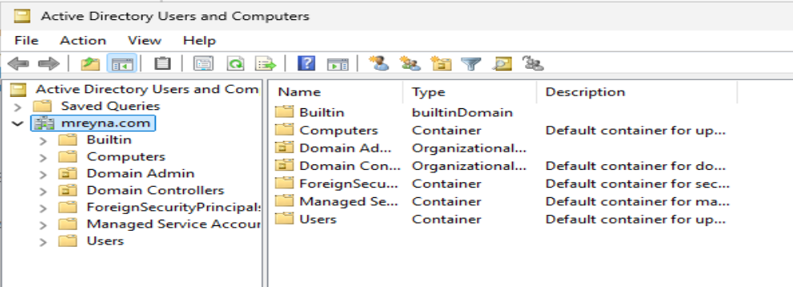

## 5. Active Directory, Remote Access, and DHCP Setup

With my server fully prepped, I moved into the core configuration phase — setting up **Active Directory Domain Services (ADDS)** and configuring the supporting roles required for a functional enterprise network. This included installing ADDS, promoting the server to a Domain Controller, creating a dedicated admin account, enabling Remote Access and NAT, and configuring DHCP for automatic IP assignments.

---

### 5.1 Installing Active Directory Roles & Features
I began by opening **Server Manager** and using the **Add Roles and Features Wizard** to install the **Active Directory Domain Services (ADDS)** role. This installation also included the necessary management tools for AD administration.

**Key steps:**
1. Launch **Add Roles and Features**.
2. Select **Role-based** installation.
3. Choose the target server (`DC`).
4. Add the **Active Directory Domain Services** role.
5. Complete the wizard and verify successful installation.

---

### 5.2 Configuring the Domain
Once ADDS was installed, I promoted the server to a **Domain Controller** and created a new forest.

**Configuration details:**
- **Forest name:** `mreyna.com`
- **Functional levels:** Default (Windows Server 2025 equivalent)
- **DNS Server & Global Catalog:** Enabled
- **DSRM password:** `Password1` *(Lab only — not secure for production)*
- **NetBIOS name:** Auto-generated
- **Paths:** Default directories
- **Post-installation:** Allowed warnings related to incomplete configuration since supporting roles were added later

After completing the wizard, the server restarted, and I verified domain functionality by confirming the login format `MREYNA/Administrator`.

---

### 5.3 Creating a Domain Admin Account
To follow best practices, I created a dedicated **Domain Admin** account instead of using the built-in `Administrator`.

**Details:**
- **OU:** `Domain Admin`
- **Username:** `a-mreyna`
- **Password:** `Password1` *(Lab only)*
- **Policy:** Password never expires
- **Membership:** Added to **Domain Admins** group

I then manually restarted the VM and logged in with the new Domain Admin account to ensure proper access and separation from the default admin.

---

### 5.4 Setting Up Remote Access & NAT
Next, I installed the **Remote Access** role to enable **Remote Access Services (RAS)** and **Network Address Translation (NAT)**. This allows internal network clients to route traffic through the Domain Controller.

**Process:**
1. Add the **Remote Access** role via **Server Manager**.
2. Select `DirectAccess and VPN (RAS)` and `Routing`.
3. After installation, open **Routing and Remote Access** from the **Tools** menu.
4. Configure and enable Routing and Remote Access.
5. Choose **Network Address Translation**.
6. Assign the internal interface `_Internal_` with IP `172.16.0.1`.
7. Enable DirectAccess and refresh configuration.
8. Perform a manual restart to finalize setup.

---

### 5.5 Configuring DHCP
To automate IP assignments, I configured **DHCP** on the Domain Controller.

**DHCP Scope:**
- **Scope name:** `Scope1`
- **IP range:** `172.16.0.100` – `172.16.0.200`
- **Subnet mask:** `255.255.255.0`
- **Lease duration:** 8 days (lab environment)
- **Default gateway:** `172.16.0.1`
- **DNS server:** `172.16.0.1`
- **WINS:** Not used
- **Activation:** Enabled immediately after configuration

I verified the DHCP service by confirming that my Windows 10 client automatically received an IP from the Domain Controller.

---

### 5.6 Screenshots
To help visualize the configuration, I’ve included screenshots of the process:

**ADDS Installation Wizard**  
  

**Domain Promotion Settings**  
  

**Domain Admin Account Creation**  
  

**Remote Access Setup**  
  

**DHCP Scope Configuration**  
  

---

At this point, the lab environment had a fully functional domain with centralized authentication, remote access capability, and automated IP distribution — replicating a real-world enterprise setup.

---

---

[ Back: Pre-Active Directory Configuration (Critical Setup Steps)](Pre-Active-Directory-Configuration-(Critical-Setup-Steps).md) | [ Next: Mass New ADUser Script](06-Mass-New-ADUser-Script.md)
