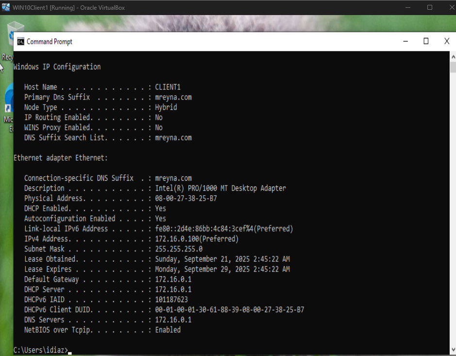
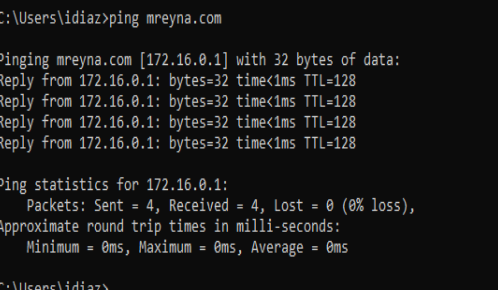
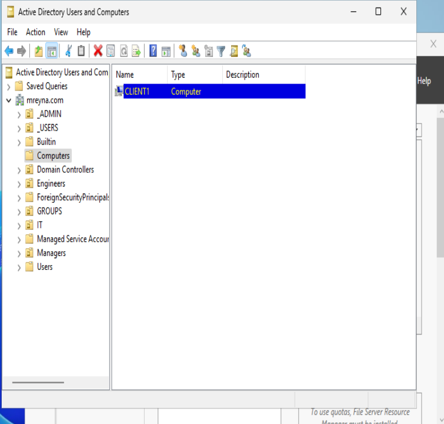

## 7. Windows 10 (Client1) Setup

With my Domain Controller fully set up, the next step was to integrate my Windows 10 machine into the `mreyna.com` domain so it could authenticate users, receive DHCP leases, and participate in the lab network.

---

### 7.1 Verifying Network Configuration
Before joining the domain, I made sure the Windows 10 client was configured to use the Domain Controller as its primary DNS server. Without this, domain lookups would fail.

**The steps to configure the clients network are the same as the AD server.** 

**What I did:**
1. Before starting the Windows 10 VM, I made sure that the adapter settings through virtual box was set to `Internal Network` and the name being `intnet`. I also made sure that no other adapters were enabled.  
2. Edited the IPv4 settings to:
   - **Obtain IP address automatically** (via DHCP from the DC)
   - **Preferred DNS server**: `172.16.0.1`
3. Ran `ipconfig /release` and `ipconfig /renew` in Command Prompt to confirm I got an IP from the correct DHCP scope.

---

### 6.2 Testing Connectivity
I verified communication with the Domain Controller by:
- **Pinging** `172.16.0.1` (IP)
- **Pinging** `mreyna.com` (FQDN)
- Using `nslookup mreyna.com` to confirm DNS resolution was working properly.

---

### 6.3 Joining the Domain
Once connectivity was confirmed, I joined the Windows 10 client to the domain.

**Steps:**
1. Right click on **Start Icon**.
2. Clicked **System**.
3. Scroll down to **Related Settings** and clinked on: **Rename this PC (advanced).
4. Entered the credentials for the domain admin account (`a-mreyna`).
5. You should be on the **Computer Name** tab.
6. The last option on that tab should start with **To rename this computer or change its domain...**, click **Change** to the right of that.
7. I changed my computer name to (`CLIENT1`).
8. Under **Member of**, Click on **Domain:**, and enter your Domain name. Mine is (`mreyna.com`). Then click OK.
9. Follow the prompts until you get a Welcome message.
10. Close everything out and restart your computer.

---

### 6.4 Verifying the Join
After rebooting, I logged in using a random domain account:
- **Username**: `ldominguez`
- Confirmed the machine appeared in **Active Directory Users and Computers** under the **Computers** container.

---

### 6.5 Screenshots
I included the following screenshots for this section:
- **Windows 10 IP configuration showing DHCP lease**
- **Ping and nslookup results**
- **Computer object in ADUC**

  
  

---

At this stage, my client machine could log in to domain accounts, resolve internal DNS queries, and communicate with the Domain Controller — completing the core foundation of the Active Directory lab environment.
